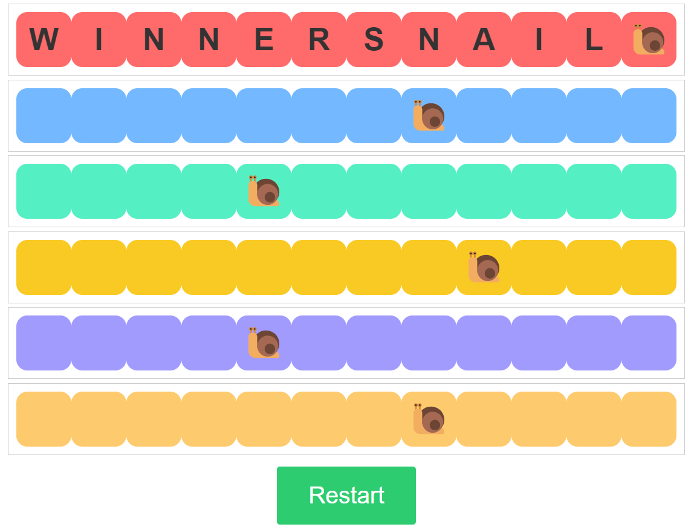

# **Snail Game** 

---

 

## **Description 📃**
<!-- add your game description here  -->
- The Snail Game is a simple web-based board game designed for complete beginners to have fun and engage in a friendly competition. The game involves racing colorful snails to reach the finish line first. Each snail is represented by a specific color, and players take turns rolling a virtual die to advance their snails on the track. The first snail to cross the finish line wins the game.

## **Functionalities 🎮**
<!-- add functionalities over here -->
- **Objective**: The objective of the game is to race your snail to the finish line before your opponents do.
- **Board Layout**: The game board consists of multiple tracks, each corresponding to a different colored snail. Each track has 12 squares, and the snails start from the first square.
- **Snails**: There are six snails in total, each represented by a different color - red, blue, green, yellow, purple, and orange.
- **Rolling the Die**: To move your snail on the track, you click the "Roll Die" button. A virtual die is rolled, and a random color is displayed as the result.
- **Movement**: When a color is rolled, the corresponding snail of that color advances one square on its track.
- **Winning Animation**: When a snail wins, its track is highlighted, and the letters "WINNERSNAIL" appear in the previous squares it has passed through.
- **Restarting the Game**: After a snail wins, you can restart the game by clicking the "Restart" button. This resets all snails to the starting position and removes the winning animation.
- **Colorful Interface**: The game has a simple and colorful interface with aesthetically pleasing visuals.

## **How to play? 🕹️**
<!-- add the steps how to play games -->
- Click the "Roll Die" button to start the game.
- The die will display a random color, and the corresponding snail of that color will advance one square on its track.
- Continue rolling the die, taking turns until one of the snails reaches the last square on its track and wins the game.
- After a snail wins, click the "Restart" button to play another round.
- The game is designed to be friendly and enjoyable for players of all ages.

 

## **Screenshots 📸**

 
<!-- add your screenshots like this -->
<!--  -->

 

## **Working video 📹**
<!-- add your working video over here -->
