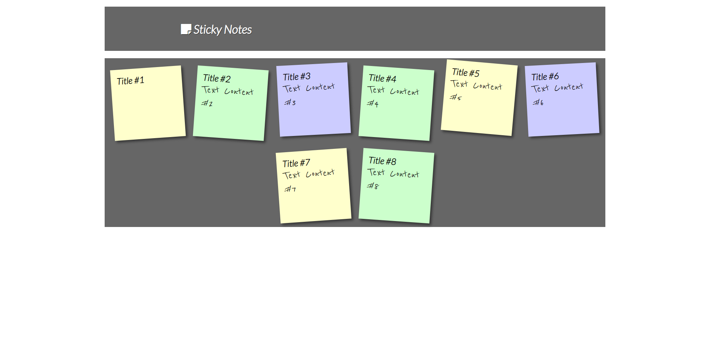

    
  </a>

<h1 align="center"> Sticky Notes</h1>

Save your notes with Sticky Notes

 

  <!-- Standard -->
  

## ⚡️  Introduction

 Sticky Notes helps you to store text in local storage

## 📷 Screenshots

