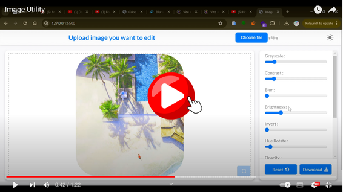
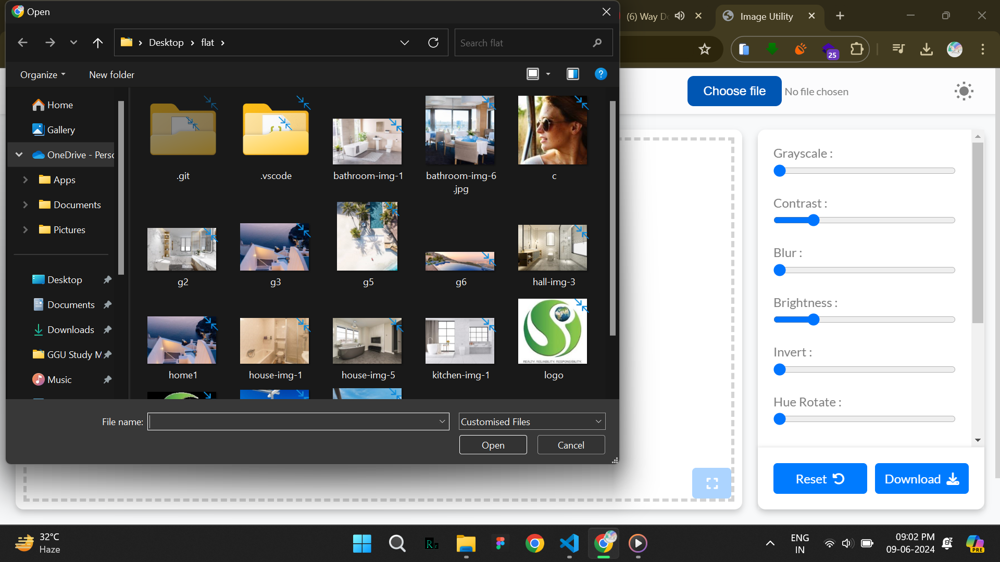
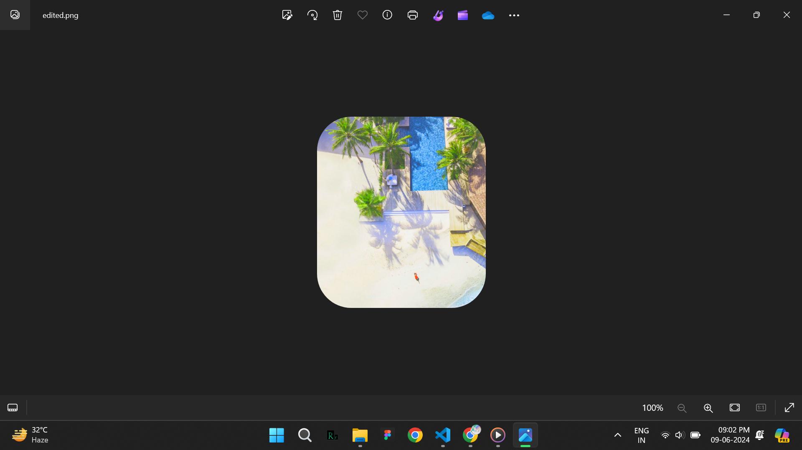
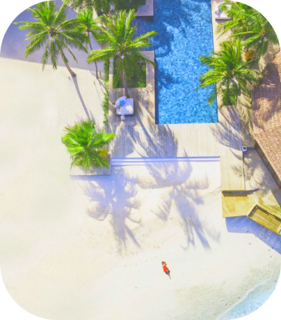

# Image Utility

This is a web application for editing images with various filters and downloading the edited image.

## Table of Contents
- [Introduction](#introduction)
- [Technologies Used](#technologies-used)
- [Features](#features)
- [Usage](#usage)
- [How to Use](#how-to-use)
- [JavaScript Functions](#javascript-functions)
- [Setting Up from GitHub](#setting-up-from-github)
- [Live Demo](#live-demo)
- [Credits](#credits)

## Introduction
This project is a web-based image utility tool that allows users to upload images, apply various filters to them, and download the edited images.

## Technologies Used
- HTML
- CSS
- JavaScript
- Font Awesome (for icons)
- Dom-to-Image (for converting DOM elements to images)

## Features
- Upload images (JPEG, PNG)
- Apply various filters like grayscale, contrast, blur, brightness, invert, hue rotate, opacity, saturate, sepia, and border radius
- Reset filters to their default values
- Toggle between pixel and percentage values for border radius
- Maximize and minimize image display
- Download the edited image
- Share the edited image (if supported by the browser)

## Usage
To use this tool, simply open the `index.html` file in your web browser. Upload an image, apply filters using the controls provided, and then download or share the edited image.

## How to Use
1. **Upload an Image**:
   - Click on "Choose File" to select an image from your device.
   
2. **Apply Filters**:
   - Adjust the sliders for various filters like grayscale, contrast, blur, brightness, etc., to modify the image.

3. **Reset**:
   - Click on the "Reset" button to reset all filters to their default values.

4. **Maximize/Minimize Image**:
   - Click on the expand/compress button to maximize or minimize the displayed image.

5. **Download Image**:
   - Click on the "Download" button to download the edited image.

6. **Share Image** (if supported):
   - Click on the "Share" button to share the edited image, if your browser supports it.

## JavaScript Functions

### `updateFilters()`
- Updates the CSS filters applied to the image based on the current slider values.

### `activateOnImageLoad()`
- Initializes event listeners on all filter input sliders after an image is loaded.

### `removeAllListeners()`
- Removes all event listeners on filter input sliders and border radius input.

### `reset()`
- Resets all filters and settings to their default values.

### `convertDivToPNG()`
- Converts the displayed image to a PNG file using `dom-to-image` library.

### Event Listeners:
- Various event listeners for buttons such as download, reset, maximize/minimize, and share.

### Initialization:
- Loads the preloader and hides it after the content is loaded.
  
## Setting Up from GitHub
1. Clone the repository to your local machine using `git clone <repository-url>`.
2. Open the project directory in your code editor.
3. Open the `index.html` file in a web browser to use the application.

## Video Demo

## Screenshots

**Image before editing**

**Image after editing**

## Credits
- Made with 💗 by [Surojit](https://mondalsurojit.github.io/Surojit/)

---

For more details, please check out the live demo or the code repository.
