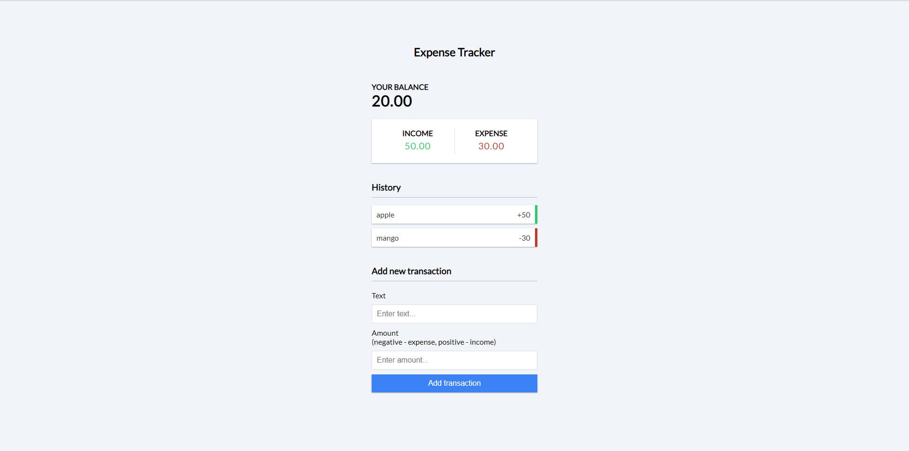

    
  </a>

<h1 align="center"> Expense Tracker </h1>

  Expense Tracker made through HTML,CSS and JAVASCRIPT

 

  <!-- Standard -->
  

## ⚡️  Introduction
Keep track of income and expenses. Add and remove items and save to local storage

## 📷 Screenshots

