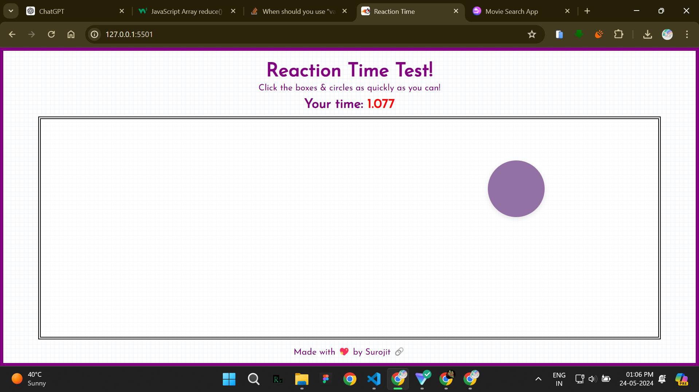
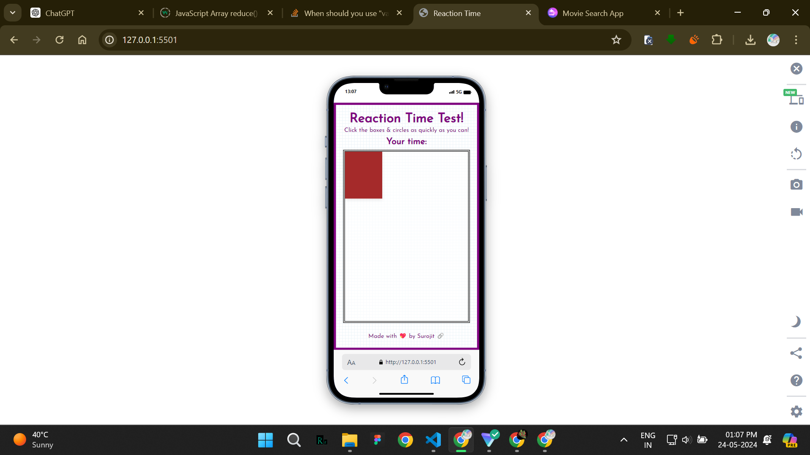

# Reaction Time Test

A simple Reaction Time Test game built with HTML, CSS, and JavaScript.

## Table of Contents

- [Overview](#overview)
- [Features](#features)
- [Technologies Used](#technologies-used)
- [Installation](#installation)
- [Usage](#usage)
- [JavaScript Functions Structure](#javascript-functions-structure)
- [Screenshots](#screenshots)
- [Contributing](#contributing)
- [License](#license)
- [Contact](#contact)

## Overview

The Reaction Time Test is a simple game designed to measure your reaction time. Click on the box as quickly as you can and get the time for your reaction. It's a fun and engaging way to challenge yourself and improve your reflexes.

## Features

- Measure reaction time by clicking on a moving box
- Randomly change box color, shape, and position after each click
- Simple and intuitive user interface

## Technologies Used

- HTML5
- CSS3
- JavaScript

## Installation

1. Clone the repository:
    ```sh
    git clone https://github.com/your-username/reaction-time-test.git
    ```
2. Navigate to the project directory:
    ```sh
    cd reaction-time-test
    ```
3. Open `index.html` in your preferred web browser.

## Usage

1. Open the app in your web browser.
2. Click on the box as quickly as possible to measure your reaction time.
3. The app will display the time taken to click on the box after each click.
4. Enjoy and challenge yourself to improve your reaction time!

## JavaScript Functions Structure

The JavaScript code in this project is organized into several functions to handle different parts of the application:

- **figureColor()**: Changes the color of the figure (box) when clicked.
- **figurePosition(top, left)**: Changes the position of the figure within the container.
- **figureShape(size)**: Changes the shape (size and border radius) of the figure.
- **fig.addEventListener("click", ...)**: Event listener to handle the click event on the figure and measure the reaction time.

## Screenshots




## Contributing

Contributions are welcome! Please fork the repository and create a pull request with your changes. Ensure that your code adheres to the project's coding standards.

1. Fork the Project
2. Create your Feature Branch (`git checkout -b feature/AmazingFeature`)
3. Commit your Changes (`git commit -m 'Add some AmazingFeature'`)
4. Push to the Branch (`git push origin feature/AmazingFeature`)
5. Open a Pull Request

## License

This project is licensed under the MIT License - see the [LICENSE](LICENSE) file for details.

## Contact

Surojit Mondal - [My LinkedIn](https://www.linkedin.com/in/surojitmondal) - [My Email](mailto:surojitmondalit@gmail.com)
