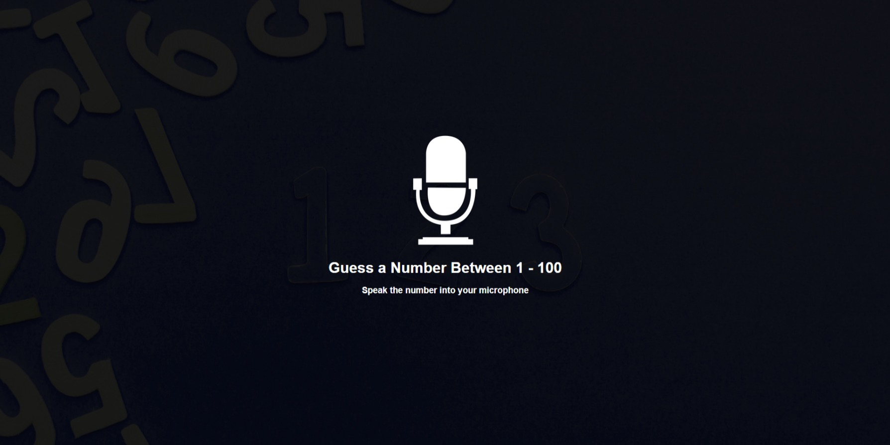
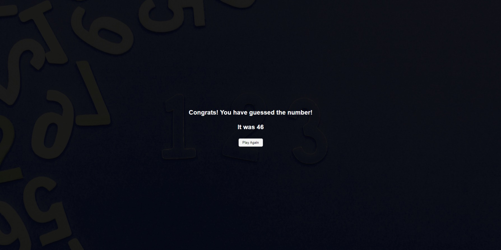

    
  </a>

<h1 align="center">  Speak Number Guessing Game</h1>

Number guessing game where you speak your guess into the microphone using the speech recognition API

 

  <!-- Standard -->
  

## ⚡️  Specifications
- Display UI directing user to speak guess
- Implement speech recognition to listen to mic
- Process user's guess and match
- Let user know higher, lower, match or not a number

## 📷 Screenshots

