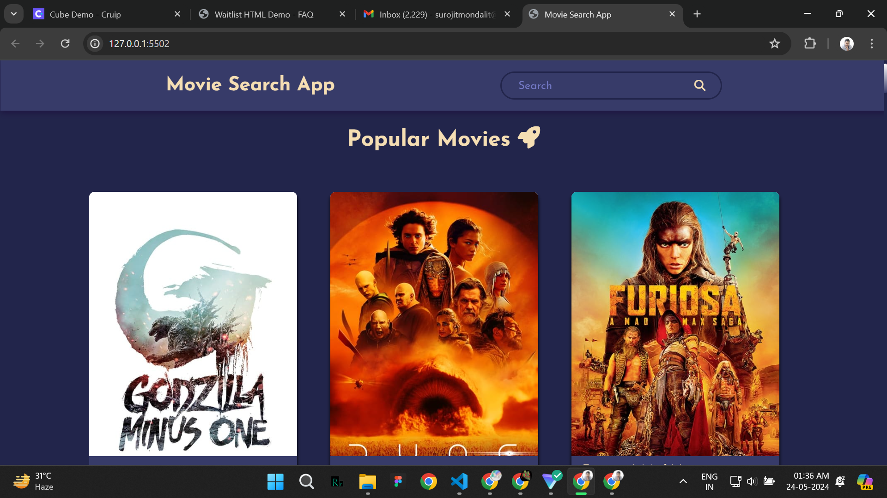

# Movie Search App

A simple and elegant Movie Search App built with HTML, CSS, and JavaScript that fetches movie information from the OMDB API.

## Table of Contents

- [Overview](#overview)
- [Features](#features)
- [Technologies Used](#technologies-used)
- [APIs Used](#apis-used)
- [Installation](#installation)
- [Usage](#usage)
- [JavaScript Functions Structure](#javascript-functions-structure)
- [Screenshots](#screenshots)
- [Contributing](#contributing)
- [License](#license)
- [Contact](#contact)

## Overview

The Movie Search App allows users to search for movies and view popular, editor's picks, and recommended movies. The app fetches data from the OMDB API and displays it in a user-friendly interface.

## Features

- Search for movies by name
- View popular movies
- Explore editor's picks
- Responsive design
- Skeleton loading screens for better user experience

## Technologies Used

- HTML5
- CSS3
- JavaScript

## APIs Used

- [OMDB API](http://www.omdbapi.com/)

## Installation

1. Clone the repository:
    ```sh
    git clone https://github.com/your-username/movie-search-app.git
    ```
2. Navigate to the project directory:
    ```sh
    cd movie-search-app
    ```
3. Open `index.html` in your preferred web browser.

## Usage

1. Open the app in your web browser.
2. Use the search bar to type the name of the movie you want to search for.
3. Press the search button or hit enter to see the search results.
4. Explore the popular movies and editor's picks.

## JavaScript Functions Structure

The JavaScript code in this project is organized into several functions to handle different parts of the application. Here's a brief overview:

- **elementFromHtml(html)**: A utility function to create a DOM element from an HTML string.
- **getMovies(url)**: Fetches movies from the OMDB API using the provided URL and handles the data to show editor's picks and search results.
- **showMovies(sectionName, data)**: Displays the movies in the specified section of the page using the data fetched from the API.
- **Event Listeners**:
  - **searchBtn.addEventListener("click", ...)**: Handles the search button click event to fetch and display search results.
  - **closePopup.addEventListener("click", ...)**: Closes the popup when the close button is clicked.
  - **logo.addEventListener("click", ...)**: Resets the search and displays the initial state of the page when the logo is clicked.
  - **window.addEventListener('scroll', ...)**: Shows or hides the scroll-up button based on the user's scroll position.
  - **scrollUp.addEventListener("click", ...)**: Scrolls the page to the top when the scroll-up button is clicked.

## Screenshots




## Contributing

Contributions are welcome! Please fork the repository and create a pull request with your changes. Ensure that your code adheres to the project's coding standards.

1. Fork the Project
2. Create your Feature Branch (`git checkout -b feature/AmazingFeature`)
3. Commit your Changes (`git commit -m 'Add some AmazingFeature'`)
4. Push to the Branch (`git push origin feature/AmazingFeature`)
5. Open a Pull Request

## License

This project is licensed under the MIT License. See the [LICENSE](LICENSE) file for details.

## Contact

Surojit Mondal - [My LinkedIn](https://www.linkedin.com/in/surojitmondal) - [My Email](mailto:surojitmondalit@gmail.com)

---
