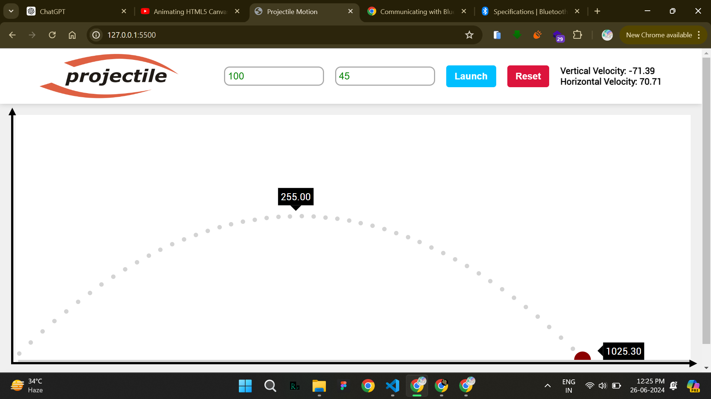

# Projectile Motion Simulator

A simple simulator for projectile motion.



## Installation

1. Clone the repository:
    ```sh
    git clone https://github.com/your-username/projectile-motion-simulator.git
    ```
2. Navigate to the project directory:
    ```sh
    cd movie-search-app
    ```
3. Open `index.html` in your preferred web browser.

## Contributing

Contributions are welcome! Please fork the repository and create a pull request with your changes. Ensure that your code adheres to the project's coding standards.

1. Fork the Project
2. Create your Feature Branch (`git checkout -b feature/AmazingFeature`)
3. Commit your Changes (`git commit -m 'Add some AmazingFeature'`)
4. Push to the Branch (`git push origin feature/AmazingFeature`)
5. Open a Pull Request

## License

This project is licensed under the MIT License. See the [LICENSE](LICENSE) file for details.

## Contact

Surojit Mondal - [My LinkedIn](https://www.linkedin.com/in/surojitmondal) - [My Email](mailto:surojitmondalit@gmail.com)

---
