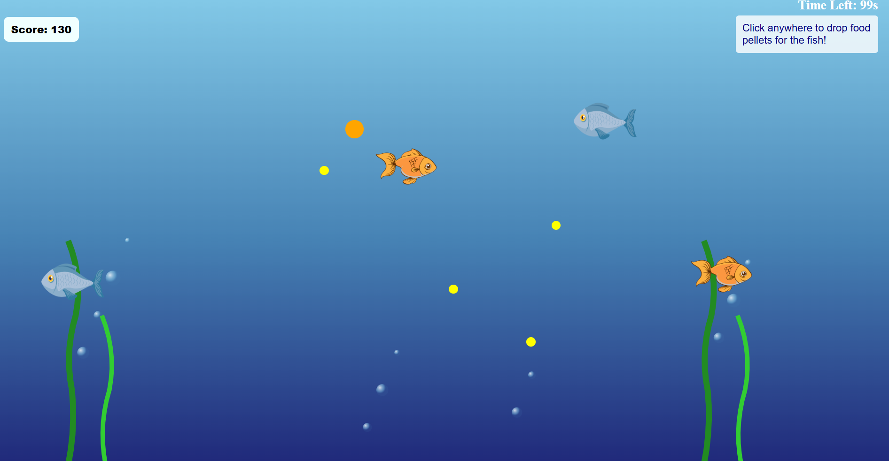

# 🐟 Fish Tank Feeder Game

A fun browser-based interactive game where you feed moving fish with food pellets! Score points by dropping food and watching the fish eat them. Every 10th pellet is special and gives bonus points!

---

## 🚀 Features

- 🎮 Click anywhere to drop food for the fish  
- 🐠 Fish swim randomly around the tank  
- 🍽️ Fish eat pellets when they're close enough  
- 💯 Score increases when fish eat food  
- 🌟 Every 10th food pellet:  
  - Is **twice the size**  
  - Awards **+20 points**

---

## 🛠️ Technologies Used

- HTML5  
- CSS3  
- JavaScript  

---

## 📝 Game Rules

- Click to drop food — timing and placement matter  
- Fish will eat pellets that are close to them  
- You get:  
  - **+10 points** per regular pellet eaten  
  - **+20 points** per special (10th) pellet eaten  
- Game runs on a **120-second timer**

---

## 📁 File Structure

fish-feeder-game/

├── assets/img
├── index.html
├── style.css
├── script.js
└── README.md

## 📷 Screenshots:

